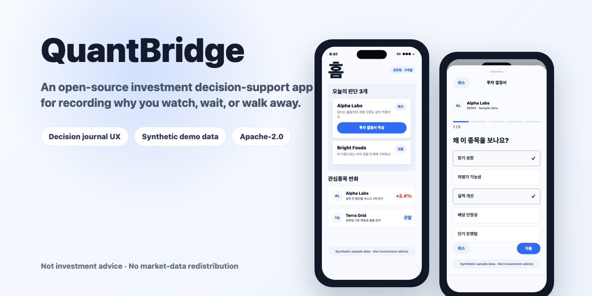
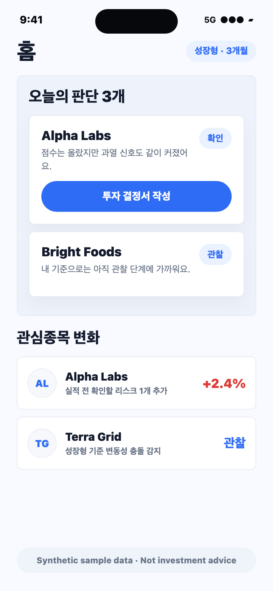
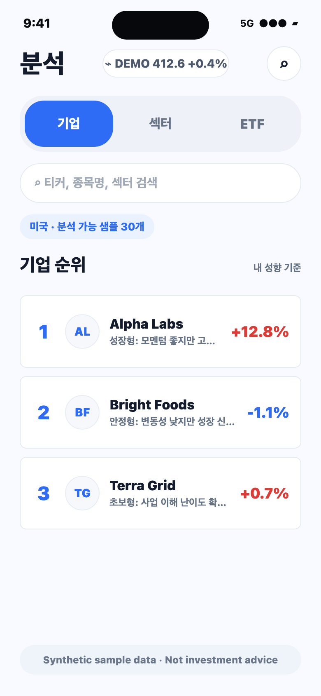
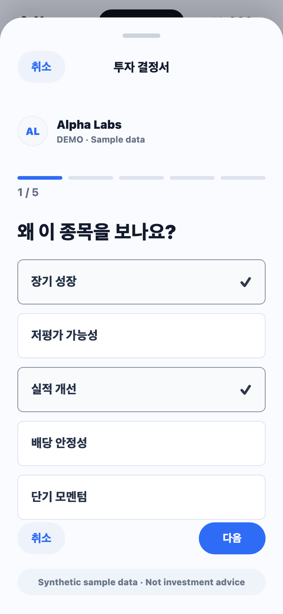
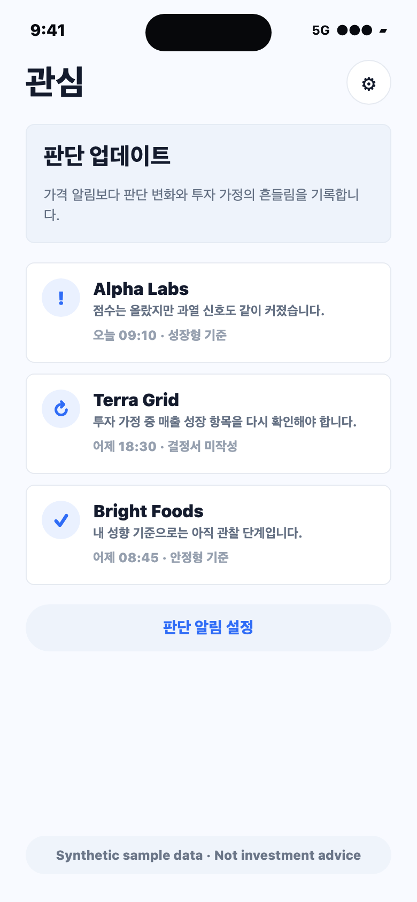

# QuantBridge

[](LICENSE)

QuantBridge is an open-source investment research and decision-support workspace
for individual investors who want to slow down before acting. It combines a
Python scoring pipeline, a FastAPI backend, Android/iOS clients, and
decision-journal UX patterns that help users record why they watch, wait, or
walk away.

This repository is designed for education, research, and personal experimentation.
It does not include market-data credentials, cached market data, brokerage
credentials, production deployment secrets, or any paid/licensed data.



> Demo screenshots use synthetic sample data only. They do not show real market
> data, company logos, brokerage data, or investment advice.

## Demo Screens

<p align="center">
  
  
  
  
</p>

## Product Highlights

- Decision journal first: users write the reason, risk, counter-argument, and
  personal fit before treating a company as actionable.
- Profile-based interpretation: the same company can be framed differently for
  growth, stability, beginner, or short-term impulse profiles.
- Judgement alerts: watchlist updates are saved as decision changes, not just
  price movement notifications.
- Curated coverage posture: the app is designed around analyzable companies and
  bring-your-own-data workflows instead of redistributing licensed market data.

## What This Project Is

- A structured way to compare companies using factor-style signals.
- A mobile app concept centered on investment decision notes, risk checks, and
  watchlist updates.
- A backend/API reference for serving scored company, portfolio, watchlist, and
  insight payloads.
- A research codebase that users can run with their own data sources.

## What This Project Is Not

- It is not investment advice.
- It is not a buy/sell signal service.
- It is not a portfolio allocation recommendation service.
- It does not redistribute KRX, Koscom, Yahoo Finance, Naver Finance, or other
  third-party market data.
- It does not provide production-ready financial data licensing.

## Repository Layout

```text
api/                 FastAPI backend
android/             Android client
Stock Analysis/      iOS SwiftUI client
pipeline/            Research and scoring pipeline
quantbridge/         Shared Python configuration, schemas, storage helpers
tools/               Local QA and development utilities
scripts/             Supporting scripts
examples/            Synthetic sample data for demos
docs/                Public release notes and legal/data guidance
```

## Quick Start

Create a local environment file:

```bash
cp .env.example .env
```

Install Python dependencies:

```bash
python -m venv .venv
source .venv/bin/activate
pip install -r requirements.txt
pip install -r api/requirements_api.txt
```

Run offline checks:

```bash
python -m unittest test_smallcap_scoring.py test_data_quality.py test_config.py
```

Run the API locally:

```bash
uvicorn api.server:app --reload --host 127.0.0.1 --port 8000
```

Android can point to `http://10.0.2.2:8000` from the emulator. The iOS simulator
can point to `http://localhost:8000`.

## Data Sources

Bring your own data. Do not commit downloaded/cached market data into this
repository.

Recommended low-risk starting points:

- Public company filings such as OpenDART or SEC EDGAR.
- User-provided CSV files for personal analysis.
- Synthetic sample data under `examples/sample_data/`.

Use of Yahoo Finance, Naver Finance, KRX/Koscom, brokerage APIs, or paid market
data must follow each provider's terms and licensing requirements.

## Public Release Posture

The public version intentionally excludes:

- `.env`
- `key.json`
- `kiwoom_credentials.json`
- SQLite databases
- Parquet/data lake files
- cached API responses
- APK/AAB/IPA build outputs
- production deployment workflows
- self-hosted runner setup
- Azure/staging secrets and scripts

See `docs/PUBLIC_RELEASE_CHECKLIST.md` before publishing.

## License

The source code in this repository is licensed under the Apache License 2.0.
Third-party market data, company logos, trademarks, API credentials, and
provider-specific datasets are not included in that license. Users must follow
the terms and licensing requirements of any data source or API they connect.

## Disclaimer

This project is for educational and research purposes only. It is not financial,
investment, tax, or legal advice. Users are responsible for verifying data
licenses, API terms, local regulations, and the suitability of any analysis
before making investment decisions.
